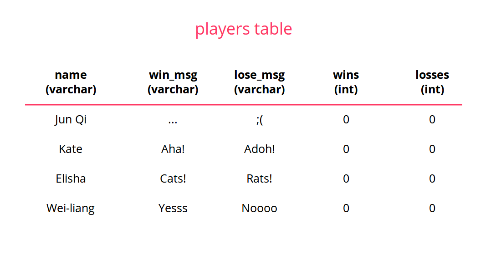

# Build a Simple HTTP Server, connected to an SQLite Database!

* [Overview](#overview)
* [Introduction](#introduction)
* [Using Libraries](#using-libraries)
* [Reading Documentation](#reading-documentation)
* [Hello World](#hello-world)
* [Serving Files](#serving-files)
* [Static vs Dynamic Content](#static-vs-dynamic-content)
* [HTTP verbs and RESTful URLs](#http-verbs-and-restful-urls)
* [| HTTP Verb | Description | Typical use](#-http-verb--description--typical-use)
* [| Request | Description |](#-request--description-)
* [GETting Players](#getting-players)
* [Connecting to a (Relational) Database](#connecting-to-a-relational-database)
* [Fetching Players from the Database](#fetching-players-from-the-database)
* [Using an ORM (Object Relational Mapper)](#using-an-orm-object-relational-mapper)
* [Bonus Section: Creating a new player](#bonus-section-creating-a-new-player)
* [References](#references)

## Overview
This tutorial will cover:

* How to use modules from the Ruby standard library
* How to install and use gems
* How to read Ruby and gem docs
* How to write a basic HTTP server
* How to serve static files from a HTTP server
* RESTful URLs and HTTP verbs/methods
* How to route URLs
* Why we use relational databases
* How to use a SQLite database
* Why we use an ORM
* How to use the Sequel ORM

## Introduction

In this tutorial, we'll walk through the process of building a super simple HTTP server that will serve a single HTML page, from the ground up. We'll eventually connect it to an SQLite database, and finally use the Object Relational Mapping (ORM) gem (a Ruby library) called [Sequel](https://github.com/jeremyevans/sequel) to handle database operations from our program.

Hopefully this will give you an appreciation of how a web application written in Rails fundamentally works. (Rails is much much more complex of course!)

## Using Libraries

As I've mentioned before, learning how to use the code written by others is a very important programming skill. Most of the times the problems that you face have been solved by others, and these smart people have put a lot of effort and thought into writing code that solves these problems, and they release their code to the public for use.

You can think of *libraries* as this bunch of code that other people have written for you to use. For example, if you want to do some computations involving complex numbers, you don't have to write everything from scratch, you can just use Ruby's `cmath` library. Or, if you want to write a web application without worrying about handling HTTP requests or managing your database, you can use a library like Rails.

Some of these libraries are installed together with a standard Ruby installation -- these are part of the *standard library* (ships with Ruby out of the box). Other libraries, such as Rails, you have to install separately. In Ruby we call them *gems*.

To write our web server, we will need to use `socket` from the standard library. In `exercises/hello_world_server.rb`, add this line at the very top:

```ruby
require 'socket'

# stuff
```

## Reading Documentation

We learnt how to read manpages to figure out Bash commands. What about Ruby? Ruby has [excellent documentation online](https://ruby-doc.org/), and you should pick up the skill of learning to read it. For now, we want to figure out how to use the `socket` library, so let's head over to [its page in the docs](https://ruby-doc.org/stdlib-2.3.1/libdoc/socket/rdoc/Socket.html). Usually the docs will give us several examples on how to use the library.

Very helpfully, it shows us snippets for how to write a simple server program:

```ruby

# Server program
require 'socket'

server = TCPServer.new 2000 # Server bound to port 2000

loop do
  client = server.accept    # Wait for a client to connect
  client.puts "Hello !"
  client.puts "Time is #{Time.now}"
  client.close
end
```

We will be doing rougly the same thing when implementing our server

## Hello World

One can never tire of Hello World it seems. We will write a server that sends a HTTP response with `Hello World` as its body.

> **Exercise**
> Open up `exercises/simple_http_server/server.rb` and follow along to complete the code before moving on
> Check out `references/simple_http_server/hello_world_server.rb` if you get lost (or just scroll down)

At the end you should get something like this:

```ruby
require 'socket'

# create a new server socket
server = TCPServer.new('localhost', 8888)

puts "Waiting on socket localhost:8888..."

loop do
  # accept a client connection and get the associated socket
  socket = server.accept

  # Read first line of the request
  request = socket.gets

  # Print request to terminal
  puts request

  response = "Hello World!\n"

  # HTTP headers
  socket.print(
  "HTTP/1.1 200 OK\r\n" +
  "Content-Type: text/html\r\n" +
  "Content-Length: #{response.bytesize}\r\n" +
  "Connection close\r\n"
  )

  # New line after headers
  # HTTP standard specifies that each line must end
  # with a carriage return (\r) and line-feed (\n)
  socket.print "\n"
  # Send response body
  socket.print response

  # Close the socket
  socket.close
end
```

Run the server with

```bash
$ ruby exercises/simple_http_server/server.rb
```
(or just `ruby server.rb` if you are in the `exercises/simple_http_server` directory)

Now, how do we test out our server? We can use our browser, of course (definitely, try it out!), but we can also use our nifty friend `curl`. Remember him?

```bash
$ curl http://localhost:8888
```

To see the HTTP headers as well, we can use the `--verbose`  option:

```bash
$ curl --verbose http://localhost:8888
```

## Serving Files

So, serving stuff to the client is just as simple as printing strings over the socket. But most of the time we don't want to just send a simple string, we want to send a whole file, like a HTML file. There should be a simple HTML file already in `exercises/simple_http_server/index.html`:

```html
<!DOCTYPE html>
<html>
  <head>
    <meta charset="utf-8">
  </head>

  <body>
    <h1>Hello World!</h1>
    <p>
      I'm a fancy HTML file. Do with me whatever you wish.
    </p>
  </body>
</html>
```

Probably the most creative HTML page you've ever seen. Anyway, we want to serve this file instead of the `"Hello World"` string.


> **Exercise**
> In the same `exercises/simple_http_server/server.rb` file, follow along to complete the code before moving on. If you get lost, refer to `references/simple_http_server/file_server.rb` (or just scroll down)

```ruby
require 'socket'

# create a new server socket
server = TCPServer.new('localhost', 8888)

puts "Waiting on socket localhost:8888..."

loop do
  # accept a client connection and get the associated socket
  socket = server.accept

  # Read first line of the request
  request = socket.gets

  # Print request to terminal
  puts request

  # Get the path to our HTML page
  path = File.join(File.dirname(__FILE__), "index.html")

  File.open(path) do |file|
    # HTTP headers
    socket.print(
    "HTTP/1.1 200 OK\r\n" +
    "Content-Type: text/html\r\n" +
    "Content-Length: #{file.size}\r\n" +
    "Connection close\r\n"
    )

    # New line after headers
    # HTTP standard specifies that each line must end
    # with a carriage return (\r) and line-feed (\n)
    socket.print "\n"
    # Send file over socket stream
    IO.copy_stream(file, socket)
  end

  # Close the socket
  socket.close
end
```

Now try `curl` again:

```bash
$ curl --verbose localhost:8888
```

And of course, visit it in your browser!

Now, notice that your server is serving the same file no matter what URL my client requests. For example, if you try any of the following, your server is still going to serve `index.html`:

```bash
$ curl localhost:8888/someurl
$ curl localhost:8888/trololol/trololol
$ curl localhost:8888/rubyrubyruby
```

That's obviously not very good behaviour.
We'll fix that soon, when we talk about URLs and routing.

## Static vs Dynamic Content
Our web server just opened a file and sent it straight over the socket. It didn't process the contents of the file in anyway. We call this *static content*.

However, a lot of the content on the web today is *dynamic*. For example, think of a product catalogue website, with thousands of products. You can get a webpage for every product in the cataglogue. Does this mean that the server stores *thousands* of HTML files and serves the corresponding one each time? No: that would waste space and entail a lot of duplication. Instead, what happens is that we store one HTML *template* on our server machine, and a *server-side web application* (just a program running on the server machine) uses that template, populates it with the relevant data (eg. product image, name and description, probably fetched from a database) and passes it to the web server program, which then serves it to the client.

This is in fact what Rails does. We won't serve dynamic content with our simple web server however, as that will get too involved. But this should allow you to understand Rails (and server-side web apps in general) better when you come to it.

## HTTP verbs and RESTful URLs

When you learn Rails you will hear a lot about REST. What the heck is REST? It's a big and complex topic, and I don't profess to understand it fully myself (hence, I will probably struggle to explain it in any clear manner). But just know -- it stands for REpresentational State Transfer, and it defines an architecture for the Web (how should computers talk to each other? How should these bunch of computers be structured?). Some smart guy called Roy Fielding coined the term in [his PhD dissertation](http://www.ics.uci.edu/~fielding/pubs/dissertation/top.htm), and it formed the basis for the design of the HTTP protocol.

I am going to try to convey to you whatever limited understanding of REST I have to you. REST imposes several architectural design constraints. One of them says that when clients talk to servers, it should ask for resources, instead of actions they want the server to do. So, imagine you have a server running a blogging application. Posts are one type of resource in this application. A non-RESTful URL to fetch a post would be something like `http://example.com/getPost?id=1`, whereas a RESTful URL would be something like `http://example.com/posts/1`. You can think of it as the distinction between nouns and verbs.

Okay, now you may wonder, what if I want to update a post? Isn't that naturally a verb-y thing? It seems natural to do `http://example.com/updatePost?id=1`. I can't use `http://example.com/posts/1` because I'm already using that for fetching a post, right?

Enter HTTP verbs, or methods. The HTTP protocol specifies that a client can send a HTTP verb in the request to specify *the action it wants to take on the resource*. The four common verbs (there are more) you will see are:

| HTTP Verb | Description | Typical use|
|-----------|-------------|------------|
| GET | Request a representation of the resource | Get a post |
| POST | Sends a body of data as a new resource for the server to store under the supplied URL | Create a new post |
| PUT | Sends a body of data to be stored under the supplied URL, replacing any existing resource | Update a post |
| DELETE | Tells the server to delete the specified resource | Delete a post |

So if we want to get a post, update a post, or delete a post (with id 1), we will make a HTTP request to the *same* URL `http://example.com/posts/1`, but with *different verbs*.

| Request | Description |
|---------|-------------|
| GET http://example.com/posts | Get a list of all posts |
| POST http://example.com/posts | Create a new post |
| GET http://example.com/posts/1 | Get a post with id 1 |
| PUT http://example.com/posts/1 | Update post with id 1 |
| DELETE http://example.com/posts/1 | Delete post with id 1 |

## GETting Players

Okay, now that we've covered the theory, let's get our web server handle some RESTful URLs. Let's say we have a file `exercises/simple_http_server/players.rb` which instantiates a bunch of players:

```ruby
# Using our Player class from Ruby 101

require_relative './player.rb'

jun_qi = Player.new("Jun Qi", "...", ";(")
kate = Player.new("Kate", "Aha!", "Adoh!")
elisha = Player.new("Elisha", "Cats!", "Rats!")
wei_liang = Player.new("Wei-liang", "Yesssss", "Noooooo.")

PLAYERS = [jun_qi, kate, elisha, wei_liang]
```

A player is a resource in our application. We want our server to handle a RESTful URL for getting a representation of a list of our player objects. So if our client makes a GET request to `http://localhost:8888/players`, we will get some text like:

```
Name: Jun Qi
Win Message: ...
Lose Message: ;(
Wins: 0, Losses: 0

Name: Kate
Win Message: Aha!
Lose Message: Adoh!
Wins: 0, Losses: 0

Name: Elisha
Win Message: Cats!
Lose Message: Rats!
Wins: 0, Losses: 0

Name: Wei-liang
Win Message: Yesssss
Lose Message: Noooooo.
Wins: 0, Losses: 0
```

How does our server know what URL our client is requesting? If you recall these lines in your `exercises/simple_http_server/server.rb` file:

```ruby
# Read first line of the request
request = socket.gets

# Print request to terminal
puts request
```
If you paid attention to the value of the `request` variable that was printed to screen, you should have realized that it was something like:

```
GET / HTTP/1.1
```

Basically, it's:

```
<HTTP method> <path to resource> HTTP/<protocol version number>
```

The `<path to resource>` part is what we need. It's basically the URL minus the hostname and scheme part (ie. `http://localhost:8888/path/to/resource` minus the `http://localhost:8888` part is just `path/to/resource`). For example if you try to `curl` to the following URL:

```bash
$ curl localhost:8888/players
```

You will see that your request line is `GET /players HTTP/1.1`.

Now our problem is that we have one whole string `"GET /players HTTP/1.1"`, but we want to extract only the `/players` part. Sure would be nice if there were a way to *split* the string into its 3 components, so we can get the second one which we want.

Oh, whaddya know, that's exactly what we're going to do. In your `exercises/simple_http_server/server.rb` file:

```ruby
# Read first line of the request
request = socket.gets

# Print request line to terminal
puts request

# Extract the path from the request line
# we split the string by a whitespace " "
request_path = request.split(" ")[1]

# Print path to terminal
puts "Requested path is #{request_path}"
```

Test that it works:

```bash
$ curl localhost:8888
$ curl localhost:8888/players
$ curl localhost:8888/blahblah/blah
```

Now that we know how to extract URL information from our request, we can make our server respond differently depending on the URL. For instance, if the client requests the `/` path, the server should just serve the `index.html` file (like it's doing now). If the client requests the `/players` path, the server should return a text response displaying a list of players, with each player's name, win message, lose message, and number of wins and losses. If the client requests any other path, like `/somerandompath`, the server should inform the client that it couldn't find any resource at that path. This process of matching URLs to server responses is called **routing**. (Yes, you will see this when you do Rails; or any web app, for that matter).

Hmmm...that sounds awfully lot like...control flow?

> **Exercise**
> Take 5 minutes to think about how to restructure your code to add URL routing
> The paragraph above already outlined the basic logic

We end up with something like this:

```ruby
# Route based on URL
if request_path == "/"
  # Get the path to our HTML page
  path = File.join(File.dirname(__FILE__), "index.html")

  File.open(path) do |file|
    # HTTP headers
    socket.print(
    "HTTP/1.1 200 OK\r\n" +
    "Content-Type: text/html\r\n" +
    "Content-Length: #{file.size}\r\n" +
    "Connection close\r\n"
    )

    # New line after headers
    # HTTP standard specifies that each line must end
    # with a carriage return (\r) and line-feed (\n)
    socket.print "\r\n"
    # Send file over socket stream
    IO.copy_stream(file, socket)
  end
elsif request_path.include?("/players")
  # construct our response body
  response = ""
  # we required the player.rb file at the top
  # so we have access to the PLAYERS constant
  PLAYERS.each do |player|
    response +=
      "Name: #{player.name}\n" +
      "Win Message: #{player.win_msg}\n" +
      "Lose Message: #{player.lose_msg}\n" +
      "Wins: #{player.wins}, Losses: #{player.losses}\n" +
      "\n"
  end

  # HTTP headers
  # note the content type is text/plain
  # instead of text/html
  socket.print(
  "HTTP/1.1 200 OK\r\n" +
  "Content-Type: text/plain\r\n" +
  "Content-Length: #{response.bytesize}\r\n" +
  "Connection close\r\n"
  )

  # New line after headers
  # HTTP standard specifies that each line must end
  # with a carriage return (\r) and line-feed (\n)
  socket.print "\r\n"
  socket.print response
else
  response = "404 Not Found\n"

  # HTTP headers
  # note the content type is text/plain
  # instead of text/html
  socket.print(
  "HTTP/1.1 404 Not Found\r\n" +
  "Content-Type: text/plain\r\n" +
  "Content-Length: #{response.bytesize}\r\n" +
  "Connection close\r\n"
  )

  # New line after headers
  # HTTP standard specifies that each line must end
  # with a carriage return (\r) and line-feed (\n)
  socket.print "\r\n"
  socket.print response
end
```

Well, the basic logic is there, but looking at that horrendous `if...elsif...else` block is making me shudder. Too much copy-pasta! Heck, even the comments were copied! Time to refactor ;)

What duplicate logic looks like it can be extracted? At first glance, the HTTP headers, along with the extra `"\r\n"` that is printed after it. Let's put it in a function. However, you'll notice that the HTTP headers aren't *exactly* the same for all branches -- the status code, content type, and content length are different. So let's pass the different parts in as arguments:

```ruby
def http_headers(status_code, content_type, content_length)
  "HTTP/1.1 #{status_code}\r\n" +
  "Content-Type: #{content_type}\r\n" +
  "Content-Length: #{content_length}\r\n" +
  "Connection close\r\n" +
  "\r\n"
end
```

Then we change everything to use that function instead:

```ruby
# Route based on URL
if request_path == "/"
  # Get the path to our HTML page
  path = File.join(File.dirname(__FILE__), "index.html")

  File.open(path) do |file|
    socket.print(http_headers("200 OK", "text/html", file.size))
    # Send file over socket stream
    IO.copy_stream(file, socket)
  end

elsif request_path.include?("/players")
  # construct our response body
  response = ""
  # we required the player.rb file at the top
  # so we have access to the PLAYERS constant
  PLAYERS.each do |player|
    response +=
      "Name: #{player.name}\n" +
      "Win Message: #{player.win_msg}\n" +
      "Lose Message: #{player.lose_msg}\n" +
      "Wins: #{player.wins}, Losses: #{player.losses}\n" +
      "\n"
  end

  socket.print(http_headers("200 OK", "text/plain", response.bytesize))
  socket.print response
else
  response = "404 Not Found\n"

  socket.print(http_headers("404 Not Found", "text/plain", response.bytesize))
  socket.print response
end
```

That looks much better. It's not so long, and it's much more descriptive, because of the function name. I think we can do more though. The part where we loop through the `PLAYERS` array looks a bit nasty. Actually, it's kind of doing two things, isn't it? One part is formating each player object into a string representation, and another part is looping over all players to build up the final response string. We should definitely separate these two bits of logic. If we ever create a URL endpoint for showing a single player (eg. a URL to `http://localhost:8888/players/1`), we'll have to use that "format player object as a string" logic again.

Let's write another function, again with a description name:

```ruby
def format_player(player)
  "Name: #{player.name}\n" +
  "Win Message: #{player.win_msg}\n" +
  "Lose Message: #{player.lose_msg}\n" +
  "Wins: #{player.wins}, Losses: #{player.losses}\n"
end
```

Now we can rewrite the server code:

```ruby
response = ""
PLAYERS.each do |player|
  response += format_player(player) + "\n"
end
```

Let's go one further. Notice that with the way we're doing things now, our response string is going to have one extra `"\n"` at the end. That's not a disaster, but it's kind of annoying. Let's get rid of it, and learn two new Array methods at the same time:

```ruby
formatted_players = PLAYERS.map do |player|
  format_player(player)
end
response = formatted_players.join("\n")
```

`map` means we take an array, and we return a new array whose values are *mapped* from the original array, based on whatever we do inside the block. In the block, we are calling the `format_player(player)` function, and this returns the formatted string representation of a player. So from an array of player objects we get an array of strings, each string being the representation of each player object.

Then, we `join` the strings in the array together with a newline character, to get the final response string. Now we just rewrite it again to make it even shorter:

```ruby
response = PLAYERS.map{|player| format_player(player)}.join("\n")
```

The final file looks like this (or refer to `references/simple_http_server/restful_server_refactored.rb`):

```ruby
require 'socket'
require_relative './players.rb'

# helper functions

def http_headers(status_code, content_type, content_length)
  "HTTP/1.1 #{status_code}\r\n" +
  "Content-Type: #{content_type}\r\n" +
  "Content-Length: #{content_length}\r\n" +
  "Connection close\r\n" +
  "\r\n"
end

def format_player(player)
  "Name: #{player.name}\n" +
  "Win Message: #{player.win_msg}\n" +
  "Lose Message: #{player.lose_msg}\n" +
  "Wins: #{player.wins}, Losses: #{player.losses}\n"
end

# create a new server socket
server = TCPServer.new('localhost', 8888)

puts "Waiting on socket localhost:8888..."

loop do
  # accept a client connection and get the associated socket
  socket = server.accept

  # Read first line of the request
  request = socket.gets

  # Print request line to terminal
  puts request

  # Extract the path from the request line
  # we split the string by a whitespace " "
  request_path = request.split(" ")[1]

  # Print path to terminal
  puts "Requested path is #{request_path}"

  # Route based on URL
  if request_path == "/"
    # Get the path to our HTML page
    path = File.join(File.dirname(__FILE__), "index.html")

    File.open(path) do |file|
      socket.print(http_headers("200 OK", "text/html", file.size))
      # Send file over socket stream
      IO.copy_stream(file, socket)
    end

  elsif request_path.include?("/players")
    response = PLAYERS.map{|p| format_player(p)}.join("\n")

    socket.print(http_headers("200 OK", "text/plain", response.bytesize))
    socket.print response
  else
    response = "404 Not Found\n"

    socket.print(http_headers("404 Not Found", "text/plain", response.bytesize))
    socket.print response
  end

   # Close the socket
  socket.close
end
```

Of course, test to see that everything's still working:

```bash
$ curl localhost:8888
$ curl localhost:8888/players
$ curl localhost:8888/blahhhsdfsdfsdf
```

> **Extras**
> Add logic to handle a URL like http://localhost:8888/players/1
> You can treat the array index in PLAYERS as the player id in the URL
> eg. with `PLAYERS = [jun_qi, kate, elisha, wei_liang]`, the URL http://localhost:8888/players/0 should return a representation of the `jun_qi` player object

## Connecting to a (Relational) Database
Pretty much all applications (web or not) need to store data. For that we need a *database*. *Database* is just a very general term referring to an organized collection of data, so, heck, if we stored our data by simply writing text files to disk, [we could call that a database too](https://en.wikipedia.org/wiki/Flat_file_database). But this is not going to work for real-world applications which deal with *huge* amounts of data.

How do we store and fetch such data quickly? How do we do so in an error-free way? How can we guarantee our data was saved properly? People have come up with all kinds of *database models* -- ways of structuring a database -- to solve these problems. One of these models is the **relational model**, the most popular model in use. In a relational model we structure data into tables with rows and columns. So, for example, I have a table of players. I need to store their name, win message, lose message, wins, and losses, so my database table will have a name column, a win message column, a lose message column, a wins column and a losses column. Each column has a certain datatype. I also have several player *records* stored in my database. Each record corresponds to a row.



The relatively simple structure of a database using a relational model, or a **relational database**, allows us to easily retrieve data and maintain data integrity (for example, it allows us to ensure that when a post is deleted, all its associated comments will also be removed from the database, and not just left orphaned there; or when we create a new comment, it must associated to some existing post)

In the end, your data is stored somewhere on your disk, as a bunch of files. But how to manage the structure of these files (so that saved data is structured according to the relational model), where they are stored, how to fetch them etc. are problems handled by *Database Management Systems* (DBMS). These are software programs written (again) by a bunch of smart people. To use DBMSes, you have to use a *database language*. The de facto standard used for relational databases is called Structured Query Language (SQL).

The relational DBMS we will be using for this project is a lightweight one called [SQLite](https://en.wikipedia.org/wiki/SQLite). The SQLite software should already be installed on your Cloud9 Ubuntu system. To use it with Ruby, however, we still need to install the [`sqlite3-ruby` gem](https://github.com/sparklemotion/sqlite3-ruby) (remember, gems are Ruby libraries that are not included in the standard Ruby installation).

> **IMPORTANT**: Make sure you are executing all your terminal commands from the `exercises/simple_http_server` directory from now onwards. Or you will confuse yourself. Trust me

Inside the `exercises/simple_http_server` directory, run:

```bash
$ bundler init
```

(Note: you should have installed the `bundler` gem before this. If you get something like `bash: bundle: command not found`, run `gem install bundler` to install bundler)

We're using the `bundler` command here. Bundler is Ruby's dependency management tool. What is dependency management? Because we are using other people's libraries, we are depending on their code. Their libraries become *dependecies* of our application -- our application won't work without them. Bundler helps us easily manage and install all the libraries that we are using. You can read more about it with `bundler --help`.

Now `bundler init` should have created a file called `Gemfile`. We specify the gems that our application needs in here. Open it up in your editor, and edit to the following:

```ruby
# frozen_string_literal: true
source "https://rubygems.org"

gem "sqlite3"
```

Now run:

```bash
$ bundler install
```

Now open up the `exercises/simple_http_server/init_db.rb` file and fill it in to get the following:

```ruby
require 'sqlite3'

# Open the database
db = SQLite3::Database.new("database.db")

# Create a players table
db.execute <<~SQL
  create table players (
    id int primary key,
    name varchar(50),
    win_msg varchar(100),
    lose_msg varchar(100),
    wins int,
    losses int
  )
SQL

db.execute(
  "INSERT INTO players (id, name, win_msg, lose_msg, wins, losses)
  VALUES (?, ?, ?, ?, ?)", [1, "Jun Qi", "...", ";(", 0, 0]
)
# and etc...
```

This file opens a connection to the sqlite3 database, creates a new `players` table, and inserts 4 player records into the table. The strange looking `<<~SQL...SQL` construct is something called a *heredoc*. It's a nicer way of writing multi-line strings (vs. all the `+ "\n"`s). The string inside the heredoc is actually an SQL statement to create the players table. That's the third language we've encountered today! Below the part you've filled in, we're running more SQL statements to insert player records into the database. Note that we've given each player an *id* to uniquely identify them in the database table (in database parlance, the id is the *primary key*; we could have used another column for the primary key, like, say, name. It's just that, names may not always be unique, and using `id` is more similar to how Rails does it, so you get that familiarity).

Now run the file to create the players table and insert the records:

```bash
$ ruby init_db.rb
```
Notice that this creates a `database.db` file in the directory (run `ls` to check).

(If you get any errors at this point, do the following:
```bash
sqlite3 database.db
```
You will enter the SQLite3 console:

```
sqlite> drop table players;
```

This will delete the players table so you can rerun `ruby init_db.rb` file without problems. Note the `;` at the end. Then:

```
sqlite> .quit
$ ruby init_db.rb
```
)

How can we quickly check to see if our players were inserted correctly? Open the database in the sqlite3 console from your terminal:

```bash
$ sqlite3 database.db
```

Run the SQL query:

```
sqlite> select * from players;
```

You should get something like:

```
Jun Qi|...|;(|0|0
Kate|Aha!|Adoh!|0|0
Elisha|Cats!|Rats!|0|0
Wei-liang|Yesssss|Noooooo.|0|0
```

Okay, we know our player records are properly saved. Now, how do we use the database in our web server program?

## Fetching Players from the Database

> **IMPORTANT**: Make sure you are executing all your terminal commands from the `exercises/simple_http_server` directory from now onwards. Or you will confuse yourself. Trust me

First off, in your `server.rb`, remove the `require_relative ./players.rb` line. We are no longer going to need that. Add `require "sqlite3"` instead:

```ruby
require 'socket'
# delete the line below
require_relative './players.rb'

# add this
require 'sqlite3'
```

Now we also need to open a connection to the database in this file:

```ruby
# Open the database
db = SQLite3::Database.new("database.db")

# create a new server socket
server = TCPServer.new('localhost', 8888)

# etc...
```

Down in the `elsif request_path == "/players"` block, we need to fetch the player records. We should also delete the `response = PLAYERS.map{|p| format_player(p)}.join("\n")` line:

```ruby
  # etc...
elsif request_path == "/players"
  # new lines here
  players = db.execute("select * from players")
  puts players.inspect

  socket.print(http_headers("200 OK", "text/plain", response.bytesize))
  socket.print response
else
  # etc..
```

We use `db.execute("select * from players")` to execute the very same SQL query that we previously ran in the sqlite3 console. Just to be sure what is being returned from the `db.execute` function, we print the `players` variable to screen. (The `.inspect` means something like: convert it to a string with extra detail). Test out your server now:

```bash
$ ruby server.rb
```

In another terminal:

```bash
$ curl localhost:8888/players
```

You server will crash (hopefully you can understand why). But that's okay, we just wanted to find out what the `players` variable is storing. We get something like:

```ruby
[["Jun Qi", "...", ";(", 0, 0],
["Kate", "Aha!", "Adoh!", 0, 0],
["Elisha", "Cats!", "Rats!", 0, 0],
["Wei-liang", "Yesssss", "Noooooo.", 0, 0]]
```

printed to screen. So `players` is an array of an arrays. Each inner array is a player. First element corresponds to name, second to win message, and so on.

Uh-oh, it looks like we have a problem. Last time our array of players was an array of objects, so our `format_player` function expected a player object to work. Now we have an array of arrays, we can no longer do:

```ruby
response = players.map{|player| format_player(player)}.join("\n")
```
(try it if you don't believe me)

Okay, we'll be lazy for now, and forget about the `format_player` function. We will just print a string representation of the array of arrays directly:

```ruby
  # etc...
elsif request_path == "/players"
  players = db.execute("select * from players")
  response = players.to_s

  socket.print(http_headers("200 OK", "text/plain", response.bytesize))
  socket.print response
else
  # etc...
```

(We use the `to_s` method on `players` to convert the array to a string representation)

Test out your server again (you know the drill). It doesn't look as nice as before, but hey, our program actually talks to a database now! We'll spruce things up in a minute.

## Using an ORM (Object Relational Mapper)

You notice by interfacing with our sqlite database directly, we had to write SQL in our Ruby code, and furthermore, we lost a nice object representation of our data -- now we just get an array of values that represent a person record. But what if we want to pass our player to a `RollAndDie` object later on (to play a game)? A player, in our application, is not just a group of *scalar*  values (single values like a string, or integer). It is a object that can win a game and lose a game. That sort of logic cannot be stored or represented in a relational database. It must exist on our server-side application. We want to construct a `Player` object from the raw data that we query from the database. We want to create an *object* from *relational data*.

Enter *Object Relational Mapping* (ORM). This is a technique for doing precisely what we want. Generally, each record in a table becomes one object (so a player record becomes an instance of `Player`), and each column in the table corresponds to an object attribute (so, the `name`, `win_msg`, `lose_msg`, `wins`, and `losses` columns become attributes of our `Player` object).

ORM libraries can construct this mapping between database table and object for us, and furthermore, can wrap our interactions with the database with Ruby methods. Meaning: we don't need to write raw SQL. Instead of:

```ruby
db.execute("select * from players")
```

we can do something like

```ruby
Player.all
```

We abstract away the details of the database! Abstraction again! Imagine if we wanted to switch out our sqlite database for something else, say a PostgreSQL or MySQL database (yes, there are a lot implementations of the SQL standard). The way we fetch all the players would be the same regardless: `Player.all`

There are various gems available that can construct this mapping between database table and object for us. Rails uses a gem called ActiveRecord. You will play with it in due time. We will instead be using the [Sequel](https://github.com/jeremyevans/sequel) gem. First add it to your Gemfile:

```ruby
# frozen_string_literal: true
source "https://rubygems.org"

gem "sqlite3"
gem "sequel"
```

Then install:

```bash
$ bundler install
```

Now we need to connect Sequel to our database. In `exercises/simple_http_server/player_model.rb`:

```ruby
require 'sqlite3'
require 'sequel'

Sequel.connect("sqlite://database.db")
```

We are going a new `Player` class in this file. (Don't worry about duplicate class names, we are no longer using the `Player` class from the other `player.rb` file). Note that I named the file `player_model.rb`. I think the convention is to use the term "model" to refer to the class that wraps the database table (you will see this in Rails too). Anyway, according to Sequel docs, for our `Player` class to wrap the `players` database table, we need to *inherit* from the `Sequel::Model` class:

```ruby
require 'sqlite3'
require 'sequel'

Sequel.connect("sqlite://database.db")

class Player < Sequel::Model(:players)
end
```

What is inheritance??? I didn't talk about it during Ruby 101, but it is actually a BIG part of object-oriented programming (time, time!), and we use it to model our problem and reduce duplicate logic. Just think of it as an IS-A relationship. Like, a `Dog` is a `Animal`, and we know all animals eat, so instead of putting the `eat` method in the `Dog` class, we can put it in the `Animal` class, and have `Dog` inherit from `Animal`. (We say that `Dog` *subclasses* `Animal`). Then, if we wanted to create other animal classes, like `Cat`, they can inherit from `Animal` and all `Cat` instances would have the `eat` method too:

```ruby
# this is pseudocode to give you can idea
class Animal
  def initialize
  # whatever...
  end

  def eat
  # whatever...
  end
end

class Dog < Animal
  # whatever
end

class Cat < Animal
  # whatever
end

doge = Dog.new(...)
cat = Cat.new(...)
doge.eat(1)
cat.eat(100)
```

In other words, if our Dog IS-AN Animal, and our Cat IS-AN Animal, our Dog and Cat should *behave* like Animals.

So, by having our `Player` inherit from the `Sequel::Model` class we basically get a whole bunch of behaviour defined in `Sequel::Model` (for free, because we didn't write it :D Yes, there are free things in this world!). Also, the `:players` in `Sequel::Model(:players)` tells Sequel that we want to wrap the `players` database table with our class.

Let's test out our new `Player class`. In `exercises/simple_http_server/player_model.rb`, at the end:

```ruby
players = Player.all
puts players.inspect
```

Now run the file:

```bash
$ ruby player_model.rb
```

You should see something like:

```
[#<Player @values={:name=>"Jun Qi", :win_msg=>"...", :lose_msg=>";(", :wins=>0, :losses=>0}>,
#<Player @values={:name=>"Kate", :win_msg=>"Aha!", :lose_msg=>"Adoh!", :wins=>0, :losses=>0}>,
#<Player @values={:name=>"Elisha", :win_msg=>"Cats!", :lose_msg=>"Rats!", :wins=>0, :losses=>0}>,
#<Player @values={:name=>"Wei-liang", :win_msg=>"Yesss", :lose_msg=>"Nooo", :wins=>0, :losses=>0}>]
```

Nice! We actually get an array of objects now! (The `#<Player...>` thing is how the object is represented when you print it out)

Now we can use this in our `exercises/simple_http_server/server.rb` file. First remove the two lines at the bottom of `exercises/simple_http_server/player_model.rb`, and modify the `Sequel.connect` line, so that you just have:

```ruby
require 'sqlite3'
require 'sequel'

Sequel.connect("sqlite://database.db")

class Player < Sequel::Model(:players)
end
```

Now in your `exercises/simple_http_server/server.rb`file:

```ruby
# add this below the require 'sqlite3' line at the top
require 'sequel'
require_relative './player_model.rb'

# stuff...

# replace this line
db = SQLite3::Database.new('database.db')
# with this line
Sequel.connect("sqlite://database.db")

# stuff...

  elsif request_path == "/players"
      # replace the next two lines
      players = db.execute("select * from players")
      response = players.to_s

      # with these two lines
      players = Player.all
      response = players.map{|player| format_player(player)}.join("\n")

      socket.print(http_headers("200 OK", "text/plain", response.bytesize))
      socket.print response
  else
    # stuff...
```

Yay, we can use our `format_player` function again! Now test out your server. You should get a nicely formatted response now.

Now let's do a bit of refactoring. If you think about `format_player`, we are always going to call this function on a `Player` object. Why not just make this a method in the `Player` class then? And, because it returns a string representation of a `Player` object, why not name it `to_s` instead of `format_player`, which follows Ruby's convention of the method that returns a string representation of objects of built-in classes like `Array` and `Hash`?

Remove `format_player` from `exercises/simple_http_server/server.rb`, and in `exercises/simple_http_server/player_model.rb`:

```ruby
class Player < Sequel::Model(:players)
  def to_s
    "Name: #{name}\n" +
    "Win Message: #{win_msg}\n" +
    "Lose Message: #{lose_msg}\n" +
    "Wins: #{wins}, Losses: #{losses}\n"
  end
end
```

See how we can just write `name`, `win_msg` etc. directly? That's because `Sequel::Model` defines those methods for us from the database columns.

Now in `exercises/simple_http_server/server.rb`:

```ruby
# replace this line
response = players.map{|player| format_player(player)}.join("\n")
# with this line
response = players.map(&:to_s).join("\n")
```

I don't think I can adequately explain the `map(&:to_s)` syntax with your expected Ruby knowledge right now, but just trust me it works. And maybe come back to it and try to understand it after you've learnt more Ruby :)

## Bonus Section: Creating a new player

There is no real bonus section, because I got too tired writing so much. But, hey, a challenge for you: handle POST requests to the URL `http://localhost:8888/players` such that your server program creates a new player from the data given in the POST body, and saves it to the database.

This is no easy task! You need to figure out a few things:

1. How to send data in a POST request with `curl`
2. How to extract the HTTP method from the request (this is pretty sraightforward)
3. How to extract the data from the HTTP request body (this is not so straightforward)
4. How to use Sequel to save a new database record
5. How to check that your implementation works

Happy hacking!

## References

Credits to [this tutorial](http://practicingruby.com/articles/implementing-an-http-file-server) for getting me started. Check it out for a more thorough minimal HTTP server implementation.
